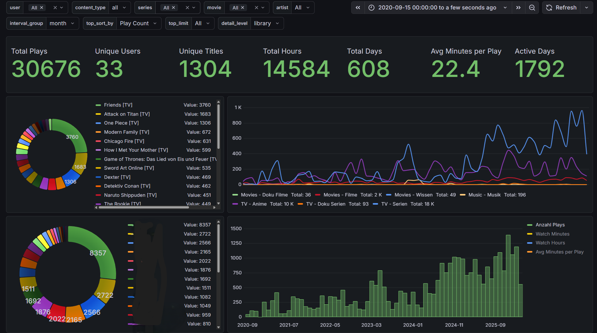
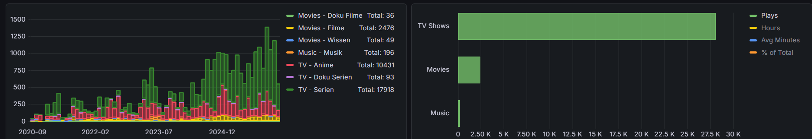

# Tautulli → PostgreSQL Sync + Grafana Dashboard

Syncs your Tautulli Plex watch history from SQLite into PostgreSQL so you can visualize it with Grafana. Runs automatically on a daily cron schedule inside Docker.

---

## Preview





---

## How It Works

On Unraid, a User Script (`unraid-sync.sh`) runs on schedule. It safely copies the live Tautulli SQLite database, starts the Docker sync container, waits for the sync to finish, then stops the container again. The Python script inside the container connects to PostgreSQL and only imports rows that are newer than the last sync — so after the initial full import, every subsequent run is fast.

```
unraid-sync.sh (User Script, scheduled)
       │
       ├─ 1. Safe SQLite backup  →  /appdata/tautull_sync/db/tautulli.db
       │
       ├─ 2. docker start tautulli-postgres
       │         │
       │         └─ tautulli_postgres_sync.py  →  PostgreSQL
       │
       └─ 3. docker stop tautulli-postgres
                                        │
                                   Grafana reads from PostgreSQL
```

---

## Requirements

- Docker
- A running PostgreSQL instance (any version 13+)
- Tautulli with its SQLite database accessible on the host
- Grafana (for the included dashboards)

---

## Docker Run

```bash
docker run -d \
  --name tautulli-postgres-sync \
  --restart unless-stopped \
  -e POSTGRES_HOST=192.168.1.100 \
  -e POSTGRES_PORT=5432 \
  -e POSTGRES_DB=tautulli \
  -e POSTGRES_USER=tautulli \
  -e POSTGRES_PASSWORD=your_secure_password \
  -e TAUTULLI_DB=/data/tautulli.db \
  -v /path/to/tautulli/appdata:/data:ro \
  -v /path/to/logs:/logs \
  ghcr.io/yourusername/tautulli-postgres-sync:latest
```

The container syncs immediately on startup, then runs automatically every night at **2:00 AM**.

---

## Build It Yourself

```bash
git clone https://github.com/yourusername/tautulli-postgres-sync.git
cd tautulli-postgres-sync

docker build -t tautulli-postgres-sync .

docker run -d \
  --name tautulli-postgres-sync \
  --restart unless-stopped \
  -e POSTGRES_HOST=192.168.1.100 \
  -e POSTGRES_PORT=5432 \
  -e POSTGRES_DB=tautulli \
  -e POSTGRES_USER=tautulli \
  -e POSTGRES_PASSWORD=your_secure_password \
  -v /mnt/user/appdata/tautulli:/data:ro \
  -v /mnt/user/appdata/tautulli-sync/logs:/logs \
  tautulli-postgres-sync
```

---

## Environment Variables

| Variable | Default | Description |
|----------|---------|-------------|
| `TAUTULLI_DB` | `/data/tautulli.db` | Path to the Tautulli SQLite file inside the container |
| `POSTGRES_HOST` | `localhost` | Hostname or IP of your PostgreSQL server |
| `POSTGRES_PORT` | `5432` | PostgreSQL port |
| `POSTGRES_DB` | `tautulli` | Target database name |
| `POSTGRES_USER` | `tautulli` | PostgreSQL username |
| `POSTGRES_PASSWORD` | `change_me` | PostgreSQL password — always set this |
| `LOG_FILE` | `/logs/sync.log` | Log file path inside the container |
| `USER_MAPPING` | *(empty)* | Inline username remapping (see below) |
| `USER_MAPPING_FILE` | `/config/user_mapping.json` | Path to a JSON mapping file |

---

## User Mapping

Plex users sometimes change their usernames. Without mapping, the same person appears under two different names in your statistics — breaking continuity across years of data.

User mapping lets you define `OldName → NewName` so all historical and future plays are attributed to the same identity in PostgreSQL.

### Option A — Inline via environment variable

Pass comma-separated `old:new` pairs:

```
-e USER_MAPPING=JohnDoe2019:JohnDoe,OldName:CurrentName
```

All plays from `JohnDoe2019` will be stored as `JohnDoe` in PostgreSQL.

### Option B — JSON file

Mount a config directory and place a `user_mapping.json` file in it:

```bash
-v /path/to/config:/config
```

`/path/to/config/user_mapping.json`:

```json
{
  "user_mapping": {
    "JohnDoe2019": "JohnDoe",
    "OldPlexName": "CurrentPlexName"
  }
}
```

The JSON file takes priority over the environment variable. If neither is configured, the sync runs without any remapping (which is fine if no one has changed their Plex username).

---

## Tables Synced

The following Tautulli tables are mirrored into PostgreSQL:

| Table | Contents |
|-------|----------|
| `users` | Plex user accounts |
| `library_sections` | Plex library metadata |
| `session_history` | Every individual play session |
| `session_history_metadata` | Title, year, media type, ratings |
| `session_history_media_info` | Codec, resolution, bitrate |

A `sync_metadata` table tracks the last synced row ID per table to enable incremental syncs on subsequent runs.

---

## Grafana Dashboards

Two ready-to-import dashboard files are included:

| File | Description |
|------|-------------|
| `Tautulli 16_9-*.json` | 16:9 optimized layout |
| `dashboard-*.json` | Alternative format for Grafana 10+ |

**To import:** Grafana → Dashboards → Import → Upload JSON file → select your PostgreSQL datasource when prompted.

**PostgreSQL datasource settings:**

- Host: `your-postgres-host:5432`
- Database: `tautulli`
- User/Password: your credentials
- TLS/SSL Mode: `disable` (for local setups)

---

## Unraid Setup

### Step 1 — Create the Docker container

In the Unraid Docker tab, add a new container. Set `--restart` to **Unless Stopped** and configure these variables and paths:

| Field | Value |
|-------|-------|
| Repository | `yourusername/tautulli-postgres-sync` |
| Network type | `bridge` |
| Variable `POSTGRES_HOST` | IP of your Unraid server |
| Variable `POSTGRES_PASSWORD` | Your PostgreSQL password |
| Path `/data` | `/mnt/user/appdata/tautull_sync/db` |
| Path `/logs` | `/mnt/user/appdata/tautull_sync/logs` |

> Important: do **not** mount the Tautulli appdata folder directly. The User Script copies the DB to a safe working directory first (see Step 2). Mount that working directory here.

### Step 2 — Set up the User Script

The included `unraid-sync.sh` is the scheduler glue. It safely copies the live Tautulli DB (using SQLite's built-in backup command so it never conflicts with a running Tautulli), starts the container, waits for the sync, then stops the container.

1. Install the **User Scripts** plugin from Community Apps
2. Create a new script, paste the contents of `unraid-sync.sh`
3. Adjust the three paths at the top of the script to match your setup:

```bash
SOURCE_DB="/mnt/user/appdata/tautulli/tautulli.db"   # your Tautulli DB
DEST_DB="/mnt/user/appdata/tautull_sync/db/tautulli.db"  # working copy (matches Docker mount)
SYNC_CONTAINER="tautulli-postgres"                    # your container name
```

4. Set the schedule — daily at 3:00 AM works well (`0 3 * * *`)

The script logs everything to `/mnt/user/appdata/tautull_sync/logs/unraid-sync.log`.

### Step 3 — First run

Click **Run Script** manually the first time. A full import of years of watch history can take several minutes. Watch progress in the log file or with:

```bash
docker logs tautulli-postgres -f
```

All subsequent scheduled runs are incremental and typically finish in seconds.

---

## Manual Sync

To trigger a sync at any time without waiting for the nightly cron:

```bash
docker exec tautulli-postgres-sync python3 /app/sync.py
```

---

## Troubleshooting

**Cannot connect to PostgreSQL**
Make sure `POSTGRES_HOST` is reachable from inside the container. Use the actual IP address, not `localhost` (which resolves to the container itself, not the host).

**Tautulli DB not found**
Confirm the volume mount points to the folder containing `tautulli.db`. Check with:
```bash
docker exec tautulli-postgres-sync ls /data/
```

**First sync is slow**
Normal behavior — a full historical import takes time proportional to how many years of data you have. Subsequent runs are fast since only new rows are fetched.

**"Permission denied" on SQLite**
The volume is mounted `:ro` (read-only), which is intentional and sufficient. If Tautulli has an exclusive write lock on the DB at the exact moment the sync runs, simply retry — the sync will pick up where it left off.

---

## Project Structure

```
tautulli-postgres-sync/
├── Dockerfile                    # Container definition
├── tautulli_postgres_sync.py     # Main sync script (runs inside Docker)
├── unraid-sync.sh                # Unraid User Script — safe DB copy + container orchestration
├── Tautulli 16_9-*.json          # Grafana dashboard (16:9 layout)
├── dashboard-*.json              # Grafana dashboard (Grafana 10+ format)
├── preview-overview.png
├── preview-charts.png
├── .gitignore
└── README.md
```
